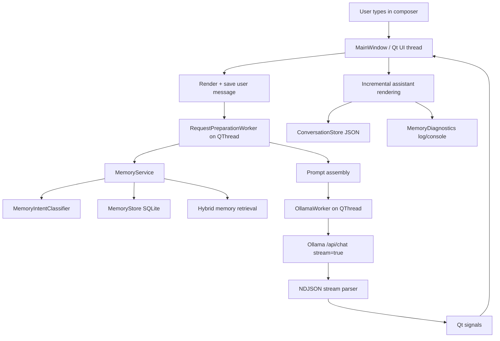

# VioletAI Developer Handoff

Version: v0.2 Pre-Release  
Last Updated: August 2026  
Status: Living document  
Branch scope: `Memory-V2`

## Read This First

This document is the authoritative technical reference for VioletAI.

Before modifying the project:

1. Read this document completely.
2. Inspect the relevant source files before editing.
3. Preserve existing architecture unless the user explicitly requests a redesign.
4. Prefer small, reversible changes over broad rewrites.
5. Add regression tests for every bug fix.
6. Never claim a feature works without verification.

When this document and the implementation disagree, inspect the current code and explain the discrepancy before making changes.

## Memory-V2 Branch Authority

This branch exists specifically to replace VioletAI's memory architecture. For memory-related work, this section overrides any conflicting instruction elsewhere in this handoff.

On `Memory-V2`, the coding agent is authorized to:

- Replace the existing memory subsystem completely.
- Delete, rename, redesign, or replace memory-related files, classes, schemas, prompts, diagnostics, UI integration, and tests.
- Introduce a new storage schema, hybrid RAG pipeline, temporary cross-chat memory, durable memory, provenance, temporal reasoning, consolidation, and migration strategy.
- Remove legacy memory paths after their replacements are implemented and verified.
- Make broad architectural changes inside the memory subsystem when a clean final design requires them.

The agent must not preserve legacy memory behavior merely because older sections describe it. Those sections are historical context until Memory V2 replaces them.

All non-memory constraints remain in force. Do not redesign unrelated chat rendering, composer behavior, Ollama streaming, conversation persistence, sidebar, themes, or general Settings behavior unless a narrowly required integration change is necessary.

Memory V2 must end with one authoritative pipeline, not parallel legacy and replacement systems. Build replacements safely, test them, switch integrations, then remove obsolete memory code.

## Project Goals

VioletAI aims to be a private, local-first AI assistant that combines:

- Natural conversation
- Reliable long-term memory
- Modern native desktop UI
- Local LLM execution
- Deterministic application behavior
- Extensible architecture

Every architectural decision should support one or more of these goals.

## Table of Contents

- [Read This First](#read-this-first)
- [Memory-V2 Branch Authority](#memory-v2-branch-authority)
- [Project Goals](#project-goals)
- [1. Overall Architecture](#1-overall-architecture)
- [2. File-by-File Explanation](#2-file-by-file-explanation)
  - [App/config.py](#appconfigpy)
  - [App/conversation_store.py](#appconversation_storepy)
  - [App/design.py](#appdesignpy)
  - [App/main.py](#appmainpy)
  - [App/memory_diagnostics.py](#appmemory_diagnosticspy)
  - [App/memory_embeddings.py](#appmemory_embeddingspy)
  - [App/memory_intent.py](#appmemory_intentpy)
  - [App/memory_manager.py](#appmemory_managerpy)
  - [App/memory_models.py](#appmemory_modelspy)
  - [App/memory_service.py](#appmemory_servicepy)
  - [App/memory_store.py](#appmemory_storepy)
  - [App/ollama_client.py](#appollama_clientpy)
  - [App/preferences.py](#apppreferencespy)
  - [App/prompts.py](#apppromptspy)
  - [App/sidebar.py](#appsidebarpy)
  - [App/widgets.py](#appwidgetspy)
- [3. Memory System](#3-memory-system)
- [4. Request Lifecycle](#4-request-lifecycle)
- [5. Current Project Philosophy](#5-current-project-philosophy)
- [6. Current State Before v0.2](#6-current-state-before-v02)
- [7. Coding Conventions](#7-coding-conventions)
- [8. Testing](#8-testing)
- [9. Future Roadmap](#9-future-roadmap)
- [Repository Evolution](#repository-evolution)

## 1. Overall Architecture

VioletAI is a native Windows desktop AI assistant built with Python, PySide6, local Ollama, local JSON conversation storage, and local SQLite long-term memory.

At a high level:



Application startup:

- Entry point is `main()` in [App/main.py](../App/main.py).
- It creates a `QApplication`, applies dark styling, builds `MainWindow`, then starts the Qt event loop.
- `MainWindow.__init__()` loads preferences, selected model, conversation store, memory store/service, creates a new conversation, builds the interface, refreshes model list in the background, rebuilds the sidebar/messages, and focuses the composer.
- Current code intentionally opens to a new chat at startup, not Settings and not the latest conversation.

Major subsystems:

- UI shell: [App/main.py](../App/main.py), [App/widgets.py](../App/widgets.py), [App/sidebar.py](../App/sidebar.py), [App/memory_manager.py](../App/memory_manager.py), [App/design.py](../App/design.py)
- Ollama streaming: [App/ollama_client.py](../App/ollama_client.py)
- Prompt construction: [App/prompts.py](../App/prompts.py)
- Conversations: [App/conversation_store.py](../App/conversation_store.py)
- Preferences: [App/preferences.py](../App/preferences.py)
- Long-term memory: [App/memory_service.py](../App/memory_service.py), [App/memory_store.py](../App/memory_store.py), [App/memory_intent.py](../App/memory_intent.py), [App/memory_models.py](../App/memory_models.py), [App/memory_embeddings.py](../App/memory_embeddings.py)
- Diagnostics: [App/memory_diagnostics.py](../App/memory_diagnostics.py)

Threading model:

- Qt widgets are created and mutated only on the UI thread.
- Memory analysis/retrieval/prompt construction runs in `RequestPreparationWorker` on a `QThread`.
- Ollama streaming runs in `OllamaWorker` on a `QThread`.
- Model discovery runs in `ModelDiscoveryWorker` on a `QThread`.
- Workers communicate back via Qt signals: `finished`, `failed`, `stopped`, `chunk_received`, `cancelled`, etc.
- UI updates happen in slots connected to those signals.

Persistence:

- Conversations are JSON files under `memory/conversations/`, managed by `ConversationStore`.
- Empty conversations are not saved.
- Long-term memories are SQLite records in `memory/memory.db`, managed only through `MemoryStore` and `MemoryService`.
- Preferences live in `memory/preferences.json`.
- Diagnostics write to `logs/memory.log` and console when enabled.

Diagnostics/logging:

- `MemoryDiagnostics` stays open across analysis, memory execution, prompt prep, Ollama streaming, rendering, and final response.
- It records stages such as Analysis, Retrieve, Execute, Prompt, Ollama Start, First Token, Generate, Render, and Total.
- It also records sanitized Ollama request/stream summaries, especially for post-memory follow-up generation.

## 2. File-by-File Explanation

### App/config.py

Purpose: central configuration.

Responsibilities:

- App name, default model, Ollama URLs, keep-alive, timeouts.
- Project paths for conversations, preferences, memory DB, logs.
- Footer text and system prompt import.

Important constraints:

- Keep runtime paths centralized here.
- Do not scatter Ollama endpoint/timeouts across modules.
- Changing timeout constants affects worker behavior and diagnostics.

Subsystem: configuration.

### App/conversation_store.py

Purpose: JSON conversation persistence.

Responsibilities:

- `Conversation` dataclass.
- Stable conversation IDs.
- Unicode-safe JSON read/write.
- Conversation title derived from first user message.
- Grouping by Pinned, Today, Yesterday, Previous 7 days, Older.
- Search, rename, pin, delete.

Important constraints:

- `save()` intentionally skips empty chats.
- Writes use temp file then replace for safer persistence.
- Only `system`, `user`, and `assistant` messages are restored.

Subsystem: conversation architecture.

### App/design.py

Purpose: centralized theme, colors, spacing, icons, and stylesheet.

Responsibilities:

- `Colors`, `Radius`, `Spacing`, `Motion`.
- PNG/SVG icon helpers.
- Global `app_stylesheet()`.

Important constraints:

- UI polish should generally flow through this file instead of one-off styles.
- Preserve dark, minimal ChatGPT-like aesthetic.
- Avoid style changes during non-UI bug fixes.

Subsystem: UI design.

### App/main.py

Purpose: primary application coordinator.

Important classes:

- `PreparedRequest`
- `RequestPreparationWorker`
- `MainWindow`

Main responsibilities:

- Build main UI.
- Own conversation state.
- Render messages.
- Start request preparation.
- Route memory results.
- Start normal or post-memory Ollama generation.
- Handle streaming chunks.
- Finalize responses and diagnostics.
- Manage cancellation/Stop.
- Manage model discovery and model switching.
- Coordinate sidebar/search/settings overlays.
- Keep Qt widget mutation on UI thread.

Important architectural decisions:

- Request preparation runs before Ollama generation and is offloaded to avoid UI blocking.
- Memory success does not directly trust LLM wording; UI confirmations are attached only after service success.
- Response ownership is guarded by `_finalized_current_response` so multiple paths do not append the same assistant message.
- Streaming is throttled through a render timer so every chunk does not force full layout work.
- Composer resizing uses deferred/stable event-loop updates to avoid layout feedback loops.

Mixed responsibility note:

- This is the largest file and contains UI composition, request lifecycle, worker wiring, streaming finalization, diagnostics coordination, and some performance logic. It may eventually deserve careful extraction, but not during focused bug fixes.

Subsystem: application coordination.

### App/memory_diagnostics.py

Purpose: compact diagnostics for memory/chat request lifecycle.

Responsibilities:

- Collect timing/event fields.
- Finalize once.
- Write compact records to console/log.
- Format classifier, memory, Ollama stream, error, assistant response, and total timing.

Important constraints:

- Do not print private/internal details unnecessarily.
- Do not finalize before streaming/rendering completes.
- Keep measured stages even if log format changes.

Subsystem: diagnostics.

### App/memory_embeddings.py

Purpose: lightweight local semantic-ish retrieval helper.

Responsibilities:

- Canonicalize text/key terms.
- Apply synonym mapping.
- Build hashed n-gram feature vectors.
- Compute cosine similarity.

Important constraints:

- Local-only and dependency-light.
- Not a real embedding model; behavior is approximate but deterministic/testable.

Subsystem: memory retrieval.

### App/memory_intent.py

Purpose: classify memory-related user messages without executing writes.

Important classes:

- `MemoryIntent`
- `MemoryAnalysis`
- `DurableMemoryDecision`
- `MemoryIntentClassifier`

Responsibilities:

- Detect explicit create/update/delete/retrieve intents.
- Support contextual commands such as “Remember that.”
- Use local LLM classification for ambiguous memory-related messages.
- Classify durable automatic memories in Suggest/Automatic modes.
- Provide deterministic fallback extraction and validation.

Important constraints:

- The classifier interprets intent only.
- It must not write to memory.
- It must not claim success.
- False positives here can hijack normal chat, so new patterns must be conservative.

Subsystem: memory analysis.

### App/memory_manager.py

Purpose: Settings overlay and Memory Manager UI.

Important classes:

- `SettingsOverlay`
- `MemoryRow`

Responsibilities:

- Settings tab layout.
- Memory search/filter/sort.
- Memory mode selector.
- Diagnostics toggle.
- Edit, archive/restore, delete, clear memories.

Important constraints:

- Settings should start hidden and refresh only when visible.
- Manual edits go through `MemoryStore.edit()`.
- Memory Manager must preserve categories and active/archive filtering.

Subsystem: settings/memory UI.

### App/memory_models.py

Purpose: typed memory data models.

Important objects:

- `CATEGORIES`
- `MemoryRecord`
- `ParsedMemory`

Responsibilities:

- Define canonical categories: User, Preferences, Projects, People, Facts, Temporary.
- Represent stored memory rows and parsed candidate memories.

Important constraints:

- Category names are part of schema/UI behavior.
- Changing fields affects store, service, UI, and tests.

Subsystem: memory models.

### App/memory_service.py

Purpose: authoritative memory execution layer.

Important classes:

- `MemoryActionResult`
- `MemoryService`

Responsibilities:

- Process user messages according to memory mode.
- Execute explicit create/update/delete/retrieve.
- Handle Off, Explicit, Suggest, Automatic modes.
- Resolve contextual commands.
- Validate LLM classifier output.
- Parse memories.
- Create/update/supersede/archive/delete records.
- Retrieve memories with hybrid ranking.
- Prevent false confirmations.
- Emit structured success/failure diagnostics.

Important constraints:

- All memory writes should go through this service.
- LLMs may classify/interpret, but deterministic validation decides.
- UI confirmation text is only included after confirmed success.
- Failure results must be structured and honest.

Subsystem: memory execution.

### App/memory_store.py

Purpose: SQLite persistence for long-term memory.

Responsibilities:

- Create schema.
- Migrate category names such as `profile` to `User`.
- Add/get/list/search/edit/archive/restore/delete memories.
- Mark accessed.
- Normalize category and normalized key.
- Preserve provenance, active/archive state, superseding IDs.

Important constraints:

- Store should remain deterministic and dumb; avoid embedding application logic here.
- Do not bypass it with raw SQL elsewhere.
- Runtime DB must not be committed.

Subsystem: memory persistence.

### App/ollama_client.py

Purpose: Ollama API integration and streaming.

Important classes/functions:

- `OllamaWorker`
- `ModelDiscoveryWorker`
- `parse_stream_line()`
- `iter_message_chunks()`
- `discover_models()`
- `OllamaError`, `InvalidStreamError`, `EmptyResponseError`, `ModelMissingError`

Responsibilities:

- POST to `/api/chat` with `stream: true`.
- Parse newline-delimited JSON safely.
- Emit chunks incrementally.
- Track empty events, done flag, first event/token diagnostics.
- Handle cancellation by closing the response.
- Surface connection, timeout, malformed stream, missing model, empty response errors.

Important constraints:

- Must never discard valid streamed content.
- Must distinguish “no events,” “events but no visible text,” timeout, cancellation, invalid JSON, and HTTP errors.
- Network work must stay off the UI thread.

Subsystem: Ollama streaming.

### App/preferences.py

Purpose: small JSON preference store.

Responsibilities:

- Selected model.
- Memory mode.
- Memory diagnostics enabled flag.

Important constraints:

- Keep preference writes local and minimal.
- Preferences file is runtime data and ignored by git.

Subsystem: preferences.

### App/prompts.py

Purpose: system prompt and message assembly.

Responsibilities:

- Base system prompt grounding current capabilities.
- Inject relevant memories into normal chat prompts.
- Build constrained post-memory follow-up prompts.

Important constraints:

- Do not let VioletAI claim unimplemented capabilities.
- Retrieved memories are context, not verified facts.
- Post-memory prompt must not force or repeat memory confirmation.

Subsystem: prompt construction.

### App/sidebar.py

Purpose: conversation sidebar and search overlay.

Important classes:

- `ConversationRow`
- `SearchOverlay`
- `ChatSidebar`

Responsibilities:

- New chat, search, settings, collapse/expand sidebar.
- Conversation grouping/selection.
- Pin/rename/delete context menu.
- Search overlay result list.

Important constraints:

- Sidebar should not trigger persistence itself except through main callbacks.
- Collapsed and expanded modes must remain stable/responsive.

Subsystem: conversation navigation UI.

### App/widgets.py

Purpose: reusable UI components.

Important classes/functions:

- `apply_interaction_cursors()`
- `ModelSelector`
- `AutoGrowingInput`
- `MarkdownView`
- `CodeHighlighter`
- `CodeBlock`
- `MessageBubble`
- `MessageActions`
- `ThinkingBubble`

Responsibilities:

- Composer input behavior.
- Markdown rendering.
- Fenced code blocks and copy button.
- Message bubbles.
- Message action buttons.
- Thinking animation.
- Cursor styling.

Important constraints:

- No internal scrollbars in messages/code blocks.
- Message height must grow with content.
- Composer must not enter compact/expanded feedback loops.
- Markdown/code rendering changes can affect layout tests.

Subsystem: reusable UI widgets.

## 3. Memory System

> **Legacy reference for the Memory-V2 branch:** This section describes the pre-Memory-V2 implementation. It is useful for understanding integrations, data, previous decisions, and known failure modes, but it is not an architecture-preservation requirement. Replace it and update this section once Memory V2 is verified.

The memory architecture is intentionally split into interpretation, validation, execution, persistence, and UI confirmation.

Core rule:

```text
LLM interprets meaning.
Application validates.
MemoryService executes.
MemoryStore persists.
UI confirms only after SUCCESS.
```

Full intended pipeline:

```text
User message
    ↓
Memory opportunity detection
    ↓
Explicit memory-intent detection or durability classification
    ↓
Structured memory decision
    ↓
MemoryService validation
    ↓
Database operation
    ↓
Structured success/failure result
    ↓
Natural-language response generation
    ↓
UI confirmation only after success
```

Modes:

- Off: memory pipeline is skipped and no durable memory write occurs.
- Explicit: only explicit user memory commands are handled.
- Suggest: automatic durable fact detection can ask for confirmation before saving.
- Automatic: high-confidence durable user facts can be saved automatically after validation.

Explicit intent detection:

- `MemoryIntentClassifier.analyze()` handles direct commands like remember/save/store/update/delete/retrieve.
- Contextual commands such as “Remember that.” resolve to the previous user message, not the assistant response.
- Natural updates like “My favorite color is now blue” route to update.
- “What do you remember?” routes to retrieval.

LLM durability classification:

- Used for Suggest/Automatic memory opportunity detection.
- Returns structured `DurableMemoryDecision`.
- The service rejects low confidence, unsupported classes, invalid categories, missing keys/values, temporary state, casual statements, and classifier failures.

Deterministic validation:

- `MemoryService._validated_automatic_decision()` checks classifier output.
- `MemoryService.parse_memory()` extracts category/subject/key/value.
- `clean_memory_value()` trims punctuation/emoticons.
- `normalize_memory_value()` normalizes device names like iPhone/iPad/MacBook/PC.

Memory Store:

- SQLite table stores value, normalized key, provenance, timestamps, active/archive state, superseding ID, expiry, language, manual edit flag.
- `profile` is migrated to `User`.
- Runtime DB is ignored by git.

Semantic retrieval:

- `memory_embeddings.py` uses local hash n-gram vectors.
- Retrieval combines term overlap, key/subject match, cosine similarity, importance, access count, and recency.
- Expired temporary records are ignored.

Duplicate handling:

- Exact normalized-key conflicts supersede older records.
- Semantic duplicate detection can archive older equivalent records.
- `migrate_duplicates()` archives older duplicates on service initialization.

Updates/superseding:

- Updates find matching active memories.
- If one clear match exists, the previous record is archived and the new value is inserted with `supersedes_memory_id`.
- Ambiguous matches return structured clarification instead of guessing.

Archiving/deletion:

- “Forget/delete/remove” operations archive matching active memories.
- Manual Memory Manager delete permanently deletes a record.
- Archive preserves history; delete removes the row.

Provenance:

- Records keep source conversation ID, source message ID, and source user text.
- Duplicate same-value saves update provenance rather than creating redundant active records.

False-confirmation prevention:

- Memory UI confirmations are stored in `MemoryActionResult.confirmation`.
- `✓ Remembered`, `Memory updated.`, and `Memory removed.` only appear after `SUCCESS`.
- Failed writes return failure reasons and do not attach success confirmations.
- The LLM is specifically instructed not to claim memory success.

Post-memory response generation:

- After a successful memory operation, `build_memory_result_response_messages()` builds a constrained prompt.
- A second Ollama streaming request generates one short natural follow-up.
- The UI confirmation remains the authoritative result.
- If follow-up generation fails, memory success is preserved and the app uses an honest fallback rather than “Done.”

Failure handling:

- Known structured statuses include `SUCCESS`, `NO_MATCH`, `MULTIPLE_MATCHES`, `INVALID_REFERENCE`, `WRITE_FAILED`, `INVALID_MEMORY_REQUEST`, `RETRIEVAL_EMPTY`, `DISABLED_BY_MODE`, and `PENDING_CONFIRMATION`.
- Failures identify the stage where possible: context resolution, candidate retrieval, validation, database execution, prompt/Ollama/generation.

## 4. Request Lifecycle

Normal user request:

```text
User presses Enter
→ MainWindow.send_message()
→ user bubble renders immediately
→ user message appended to conversation
→ conversation saved if non-empty
→ RequestPreparationWorker starts on QThread
→ MemoryService.process_user_message()
→ if not handled, retrieve relevant memories
→ build_ollama_messages()
→ MainWindow receives PreparedRequest
→ OllamaWorker starts on QThread
→ POST /api/chat stream=true
→ parse NDJSON stream
→ chunk_received signals update streamed_answer
→ render timer updates assistant bubble
→ finished signal finalizes full assistant response
→ conversation JSON saved
→ diagnostics finalized
→ controls return to Ready
```

Thread ownership:

- UI thread:
  - reading composer text
  - adding/removing widgets
  - scroll decisions
  - final render
  - conversation/sidebar UI refresh
- Request preparation thread:
  - memory intent/classifier work
  - memory retrieval
  - prompt assembly
- Ollama thread:
  - HTTP request
  - streaming response iteration
  - stream diagnostics
- Model discovery thread:
  - `/api/tags` request

Cancellation/Stop:

- Stop calls `worker.cancel()`.
- Worker marks `_cancelled = True` and closes the active `requests.Response`.
- If partial text exists, the partial answer is preserved and marked stopped.
- Controls and status return to Stopped/Ready through cleanup.
- `closeEvent()` cancels or waits for active threads safely.

Errors:

- Request-preparation failures become `Response failed` with stage `request preparation`.
- Ollama failures report stage-specific errors.
- Empty responses are distinguished from timeout, invalid JSON, missing model, and connection failure.
- If partial output exists before an error, visible partial response is preserved.

Post-memory vs normal chat:

- Normal chat injects relevant memories and streams a full answer.
- Post-memory success uses a short constrained second Ollama call with `num_predict: 64`, `temperature: 0.5`, and shorter read timeout.
- Post-memory confirmation is attached after the natural response, but only because the memory operation already succeeded.

Request ownership:

- `_finalized_current_response` prevents duplicate assistant appends.
- Active `thread` and `prep_thread` checks prevent sending/regenerating/model-switching while a request is active.
- Memory-handled responses and normal chat generation are routed through distinct branches in `_receive_prepared_request()`.

Timers/deferred rendering:

- `_render_timer` throttles streaming UI updates.
- `_composer_mode_timer` defers composer compact/multiline recalculation to one event-loop cycle.
- Scroll operations use `QTimer.singleShot(0, ...)` to let layouts settle first.
- Appearance/scroll animations use Qt animation/timer primitives.

Conversation/model switching:

- Model selectors are disabled during preparation/generation.
- Switching model updates preferences and current conversation model only when no request is active.
- Selecting/deleting conversations is handled through `ConversationStore` and UI rebuilds.

## 5. Current Project Philosophy

VioletAI’s architecture is guided by a few strong principles:

- Local-first: Ollama, memory, conversations, preferences, and logs are local.
- Privacy-first: runtime data is ignored by git; memory stays on disk locally.
- Native UI: PySide6 widgets, no Electron, no browser UI.
- Lightweight dependencies: standard library, PySide6, requests; no large frameworks.
- Deterministic execution: database writes are controlled by application code, not by LLM text.
- LLM interprets; app validates and executes.
- No false confirmations: never show memory success unless the service returned success.
- Structured failures: expose specific failure reasons instead of generic replies.
- Preserve provenance/history: superseding archives older records instead of silently overwriting.
- Fail safely: ask clarification or skip when confidence is insufficient.
- Do not hallucinate capabilities: prompts explicitly forbid claiming tools that are not implemented.
- Keep Qt widget access on the UI thread.
- Move blocking work to workers.
- Measure before optimizing.
- Keep fixes narrow and reversible.
- Preserve working behavior during focused bug fixes.
- Add regression tests for every bug class.
- Do not claim a fix unless verified.
- Keep git history recoverable.
- Runtime artifacts must not be committed.

The reasoning behind the main decisions:

- Memory is split into classifier/service/store because LLM output is useful for interpretation but unsafe as an execution authority.
- UI confirmations are separate from assistant prose because conversational language can be wrong, delayed, cancelled, or filtered.
- Streaming has its own worker because network and NDJSON iteration must never freeze Qt.
- Diagnostics span the full lifecycle because many failures happen after analysis/prompting, especially in Ollama streaming.
- Startup opens to a clean chat because it avoids surprising the user with stale context and keeps the app feeling instant.
- The prompt explicitly grounds capabilities because VioletAI’s planned future tools do not exist yet.

## 6. Current Memory-V2 Work

The Settings and UI-polish work has been completed and merged into `master`. The active `Memory-V2` branch is dedicated to replacing the legacy memory system.

Known legacy failures motivating the rewrite include:

- Questions about memory can be mistaken for memory commands.
- Normal conversational responses can be replaced by a separate memory-response path.
- Vague deletion such as “forget it” can affect multiple unrelated memories.
- Exact attributes can be confused, such as favorite color versus favorite drink.
- Memory-related replies can feel detached from VioletAI's normal conversational model.
- Similarity-based matching can outrank exact subject, entity, attribute, recency, or temporal validity.
- Updates, duplicates, contradictions, failures, and confirmations are not consistently reliable enough for the final product.

Memory V2 must include:

- One natural response path using VioletAI's primary conversational model.
- Current-chat context, temporary cross-chat episodic memory, durable memory, and archived history as distinct layers.
- A configurable context budget for cross-chat awareness.
- Hybrid RAG using exact, lexical, semantic, structured, temporal, and provenance-aware retrieval.
- Typed, atomic, verified create/update/merge/supersede/archive/restore/delete operations.
- Conservative deletion and natural clarification when a target is ambiguous.
- Provenance, version history, contradiction handling, consolidation, decay, and migration or safe reset behavior.
- Extensive deterministic, adversarial, real-Ollama, and real-Windows-GUI testing.

Do not describe Memory V2 as complete until the legacy pipeline is removed, one authoritative replacement exists, no known reproducible defects remain, and the documentation describes the implemented system accurately.

## 7. Coding Conventions

General principles:

- Keep fixes focused outside the explicitly authorized subsystem.
- Broad redesign is allowed for Memory V2 when required for one clean final architecture.
- Avoid unrelated refactoring.
- Measure before optimizing.
- Preserve UI behavior whenever possible.
- Prefer deterministic logic over LLM decisions.
- Keep blocking work off the UI thread.
- Runtime data must never be committed.
- Every bug fix should include regression tests.
- Explain root cause before explaining the fix.

Git workflow:

- Develop new work on feature branches.
- Keep master stable.
- Small logical commits.
- Push frequently.
- Tag only verified releases.

## 8. Testing

Before every significant commit:

```powershell
python -m unittest discover -s tests -v
python -m compileall -q App tests
git diff --check
```

Manual verification is required whenever changes affect:

- UI
- streaming
- memory
- startup
- settings
- threading
- Ollama integration

Automated tests should focus on regressions rather than implementation details.

## 9. Future Roadmap

After v0.2 the project roadmap is:

### Memory V2 foundation — current work

Temporary cross-chat awareness is part of the active Memory V2 rewrite, not a later feature. A new chat should begin with a fresh conversational focus while relevant recent conversations remain retrievable within a configurable token budget. Temporary episodes must decay, consolidate, or expire and must remain separate from durable saved memory.

---

### Internet search

Allow VioletAI to search the web when local knowledge is insufficient.

Search results should integrate naturally into the existing request pipeline.

---

### File understanding

Support attachments using the existing + button.

Initial supported types:

- Images
- PDF
- Text
- Source code
- Markdown
- JSON

Additional common document formats may be added later.

Files become contextual information for the active conversation.

---

### Personality improvements

Make VioletAI:

- more natural
- less scripted
- more context aware
- warmer
- more conversational
- avoid hallucinating abilities
- maintain consistent identity

---

### Real-time voice conversations

Native low-latency voice conversations.

Conversation should feel continuous instead of request/response driven.

---

### Windows OS Agent

Vision-assisted desktop interaction.

Ability to:

- understand the screen
- operate Windows
- launch applications
- interact with UI
- complete tasks safely

---

### Coding Agent

Integrated software engineering assistant capable of:

- repository understanding
- planning
- implementation
- testing
- debugging
- documentation
- Git workflow

Eventually replacing external coding agents.

---

### Continuous polishing

Before every tagged release:

- UI polish
- Settings improvements
- Performance
- Reliability
- Bug fixes
- Regression testing

Tagged releases:

v0.2

v0.3

v0.4

...

## Repository Evolution

Current milestone:

v0.1 completed

Current work:

`Memory-V2` — final memory architecture rewrite

Development model:

Stable releases are tagged.

Experimental work is performed on feature branches.

Every tagged release should be stable enough that development can continue from it indefinitely.

Release philosophy:

- Never sacrifice stability for speed.
- Each tagged release should always be usable as a long-term foundation.
- New features should not introduce regressions in existing functionality.
