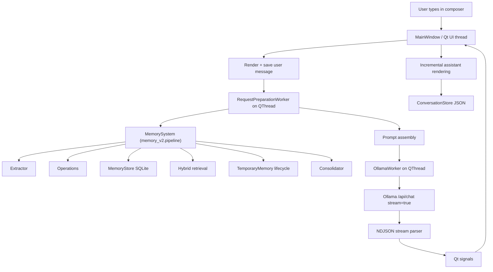

# VioletAI Developer Handoff

Version: v0.2 Pre-Release  
Last Updated: August 2026  
Status: Living document  
Branch scope: `Memory-V2`

## Read This First

This document is the authoritative technical reference for VioletAI.

Before modifying the project:

1. Read this document completely.
2. Inspect the relevant source files before editing.
3. Preserve existing architecture unless the user explicitly requests a redesign.
4. Prefer small, reversible changes over broad rewrites.
5. Add regression tests for every bug fix.
6. Never claim a feature works without verification.

When this document and the implementation disagree, inspect the current code and explain the discrepancy before making changes.

## Memory-V2 Branch Authority

This branch exists specifically to replace VioletAI's memory architecture. For memory-related work, this section overrides any conflicting instruction elsewhere in this handoff.

On `Memory-V2`, the coding agent is authorized to:

- Replace the existing memory subsystem completely.
- Delete, rename, redesign, or replace memory-related files, classes, schemas, prompts, diagnostics, UI integration, and tests.
- Introduce a new storage schema, hybrid RAG pipeline, temporary cross-chat memory, durable memory, provenance, temporal reasoning, consolidation, and migration strategy.
- Remove legacy memory paths after their replacements are implemented and verified.
- Make broad architectural changes inside the memory subsystem when a clean final design requires them.

The agent must not preserve legacy memory behavior merely because older sections describe it. Those sections are historical context until Memory V2 replaces them.

All non-memory constraints remain in force. Do not redesign unrelated chat rendering, composer behavior, Ollama streaming, conversation persistence, sidebar, themes, or general Settings behavior unless a narrowly required integration change is necessary.

Memory V2 must end with one authoritative pipeline, not parallel legacy and replacement systems. Build replacements safely, test them, switch integrations, then remove obsolete memory code.

## Project Goals

VioletAI aims to be a private, local-first AI assistant that combines:

- Natural conversation
- Reliable long-term memory
- Modern native desktop UI
- Local LLM execution
- Deterministic application behavior
- Extensible architecture

Every architectural decision should support one or more of these goals.

## Table of Contents

- [Read This First](#read-this-first)
- [Memory-V2 Branch Authority](#memory-v2-branch-authority)
- [Project Goals](#project-goals)
- [1. Overall Architecture](#1-overall-architecture)
- [2. File-by-File Explanation](#2-file-by-file-explanation)
  - [App/config.py](#appconfigpy)
  - [App/conversation_store.py](#appconversation_storepy)
  - [App/design.py](#appdesignpy)
  - [App/main.py](#appmainpy)
  - [App/memory_manager.py](#appmemory_managerpy)
  - [App/memory_v2/models.py](#appmemory_v2modelspy)
  - [App/memory_v2/normalize.py](#appmemory_v2normalizepy)
  - [App/memory_v2/embeddings.py](#appmemory_v2embeddingspy)
  - [App/memory_v2/store.py](#appmemory_v2storepy)
  - [App/memory_v2/extract.py](#appmemory_v2extractpy)
  - [App/memory_v2/operations.py](#appmemory_v2operationspy)
  - [App/memory_v2/retrieval.py](#appmemory_v2retrievalpy)
  - [App/memory_v2/temporary.py](#appmemory_v2temporarypy)
  - [App/memory_v2/consolidation.py](#appmemory_v2consolidationpy)
  - [App/memory_v2/pipeline.py](#appmemory_v2pipelinepy)
  - [App/ollama_client.py](#appollama_clientpy)
  - [App/preferences.py](#apppreferencespy)
  - [App/prompts.py](#apppromptspy)
  - [App/sidebar.py](#appsidebarpy)
  - [App/widgets.py](#appwidgetspy)
- [3. Memory System](#3-memory-system)
- [4. Request Lifecycle](#4-request-lifecycle)
- [5. Current Project Philosophy](#5-current-project-philosophy)
- [6. Current State Before v0.2](#6-current-state-before-v02)
- [7. Coding Conventions](#7-coding-conventions)
- [8. Testing](#8-testing)
- [9. Future Roadmap](#9-future-roadmap)
- [Repository Evolution](#repository-evolution)

## 1. Overall Architecture

VioletAI is a native Windows desktop AI assistant built with Python, PySide6, local Ollama, local JSON conversation storage, and local SQLite long-term memory.

At a high level:



Application startup:

- Entry point is `main()` in [App/main.py](../App/main.py).
- It creates a `QApplication`, applies dark styling, builds `MainWindow`, then starts the Qt event loop.
- `MainWindow.__init__()` loads preferences, selected model, conversation store, memory store + `MemorySystem`, creates a new conversation, builds the interface, refreshes model list in the background, rebuilds the sidebar/messages, and focuses the composer.
- Current code intentionally opens to a new chat at startup, not Settings and not the latest conversation.

Major subsystems:

- UI shell: [App/main.py](../App/main.py), [App/widgets.py](../App/widgets.py), [App/sidebar.py](../App/sidebar.py), [App/memory_manager.py](../App/memory_manager.py), [App/design.py](../App/design.py)
- Ollama streaming: [App/ollama_client.py](../App/ollama_client.py)
- Prompt construction: [App/prompts.py](../App/prompts.py)
- Conversations: [App/conversation_store.py](../App/conversation_store.py)
- Preferences: [App/preferences.py](../App/preferences.py)
- Long-term memory: [App/memory_v2/pipeline.py](../App/memory_v2/pipeline.py), [App/memory_v2/store.py](../App/memory_v2/store.py), [App/memory_v2/extract.py](../App/memory_v2/extract.py), [App/memory_v2/operations.py](../App/memory_v2/operations.py), [App/memory_v2/retrieval.py](../App/memory_v2/retrieval.py), [App/memory_v2/temporary.py](../App/memory_v2/temporary.py), [App/memory_v2/consolidation.py](../App/memory_v2/consolidation.py), [App/memory_v2/models.py](../App/memory_v2/models.py)

Threading model:

- Qt widgets are created and mutated only on the UI thread.
- Memory analysis/retrieval/prompt construction runs in `RequestPreparationWorker` on a `QThread`.
- Ollama streaming runs in `OllamaWorker` on a `QThread`.
- Model discovery runs in `ModelDiscoveryWorker` on a `QThread`.
- Workers communicate back via Qt signals: `finished`, `failed`, `stopped`, `chunk_received`, `cancelled`, etc.
- UI updates happen in slots connected to those signals.

Persistence:

- Conversations are JSON files under `memory/conversations/`, managed by `ConversationStore`.
- Empty conversations are not saved.
- Long-term memories are SQLite records in `memory/memory.db`, managed only through `MemoryStore` and the `MemorySystem` facade.
- Preferences live in `memory/preferences.json`.

## 2. File-by-File Explanation

### App/config.py

Purpose: central configuration.

Responsibilities:

- App name, default model, Ollama URLs, keep-alive, timeouts.
- Project paths for conversations, preferences, memory DB, logs.
- Footer text and system prompt import.

Important constraints:

- Keep runtime paths centralized here.
- Do not scatter Ollama endpoint/timeouts across modules.
- Changing timeout constants affects worker behavior and diagnostics.

Subsystem: configuration.

### App/conversation_store.py

Purpose: JSON conversation persistence.

Responsibilities:

- `Conversation` dataclass.
- Stable conversation IDs.
- Unicode-safe JSON read/write.
- Conversation title derived from first user message.
- Grouping by Pinned, Today, Yesterday, Previous 7 days, Older.
- Search, rename, pin, delete.

Important constraints:

- `save()` intentionally skips empty chats.
- Writes use temp file then replace for safer persistence.
- Only `system`, `user`, and `assistant` messages are restored.

Subsystem: conversation architecture.

### App/design.py

Purpose: centralized theme, colors, spacing, icons, and stylesheet.

Responsibilities:

- `Colors`, `Radius`, `Spacing`, `Motion`.
- PNG/SVG icon helpers.
- Global `app_stylesheet()`.

Important constraints:

- UI polish should generally flow through this file instead of one-off styles.
- Preserve dark, minimal ChatGPT-like aesthetic.
- Avoid style changes during non-UI bug fixes.

Subsystem: UI design.

### App/main.py

Purpose: primary application coordinator.

Important classes:

- `PreparedRequest`
- `RequestPreparationWorker`
- `MainWindow`

Main responsibilities:

- Build main UI.
- Own conversation state.
- Render messages.
- Start request preparation.
- Run memory extraction/retrieval through the single `MemorySystem` facade.
- Start Ollama generation for every user turn (single visible response path).
- Handle streaming chunks.
- Finalize responses.
- Manage cancellation/Stop.
- Manage model discovery and model switching.
- Coordinate sidebar/search/settings overlays.
- Keep Qt widget mutation on UI thread.

Important architectural decisions:

- Request preparation runs before Ollama generation and is offloaded to avoid UI blocking.
- Every user message follows exactly one response path: preparation (which may save/retrieve memory invisibly) followed by a single conversational-model stream. There is no separate post-memory response path.
- Memory operates automatically and invisibly; the app never renders memory confirmations.
- Response ownership is guarded by `_finalized_current_response` so multiple paths do not append the same assistant message.
- Streaming is throttled through a render timer so every chunk does not force full layout work.
- Composer resizing uses deferred/stable event-loop updates to avoid layout feedback loops.

Mixed responsibility note:

- This is the largest file and contains UI composition, request lifecycle, worker wiring, streaming finalization, and some performance logic. It may eventually deserve careful extraction, but not during focused bug fixes.

Subsystem: application coordination.

### App/memory_manager.py

Purpose: Settings overlay and Memory Manager UI.

Important classes:

- `SettingsOverlay`
- `MemoryRow`

Responsibilities:

- Settings tab layout.
- Memory search/filter/sort.
- Edit, archive/restore, delete, clear memories.

Important constraints:

- Settings should start hidden and refresh only when visible.
- Manual edits go through `MemoryStore.update_memory(...)` (manual provenance).
- Memory Manager must preserve categories and active/archive filtering.
- UI layer only — all logic lives in `MemoryStore`/`MemorySystem`.

Subsystem: settings/memory UI.

### App/memory_v2/models.py

Purpose: typed data models for Memory V2.

Important objects:

- `MemoryLayer` (durable / temporary / archived)
- `MemoryCategory` + `CATEGORIES`
- `ProvenanceKind` (explicit / automatic / imported / restored)
- `MutationKind`, `MutationStatus`
- `ParsedMemory`, `MemoryRecord`, `TemporaryRecord`
- `Provenance`
- `RankedMemory`, `RetrievalOutcome`
- `MemoryCommand`, `TurnAnalysis`, `TurnOutcome`

Important constraints:

- Category names are part of schema/UI behavior.
- Changing fields affects store, operations, retrieval, UI, and tests.

Subsystem: memory models.

### App/memory_v2/normalize.py

Purpose: deterministic text/key normalization.

Responsibilities:

- Clean values (trim punctuation, collapse whitespace).
- Canonicalize keys (casefold, remove filler words) so synonyms land on one slot.
- Build canonical keys from category/subject/key.

Important constraints:

- Pure, deterministic, dependency-free.
- Must be stable so retrieval and consolidation agree.

Subsystem: memory normalization.

### App/memory_v2/embeddings.py

Purpose: local deterministic embeddings for retrieval.

Responsibilities:

- Build hashed n-gram feature vectors.
- Compute cosine similarity.
- Provide synonym-aware token mapping.

Important constraints:

- Local-only and dependency-light.
- Deterministic: the same input always yields the same vector.
- Approximate but predictable; exact meaning still wins over loose similarity.

Subsystem: memory retrieval.

### App/memory_v2/store.py

Purpose: SQLite persistence for Memory V2.

Responsibilities:

- `SCHEMA_VERSION = 2` with `v2_memories`, `v2_temporary_memories`, `v2_memory_events`, `v2_conversation_trackers`.
- WAL mode.
- Migrate from legacy: back up and drop the legacy `memories` table.
- Insert/get/list/search/update/archive/restore/delete durable memories.
- Insert/list/touch/update/expire/delete temporary memories.
- Record auditable mutation events.
- Track conversation activity and token counters.
- Link supersede pairs and group by canonical key.

Important constraints:

- Store stays deterministic and dumb; application logic lives in operations/pipeline.
- Do not bypass it with raw SQL elsewhere.
- Runtime DB must not be committed.

Subsystem: memory persistence.

### App/memory_v2/extract.py

Purpose: deterministic intent + fact extraction from the user message.

Important class:

- `Extractor`

Responsibilities:

- Detect explicit create/update/delete commands.
- Resolve contextual commands (“Remember that.”) against the previous user message.
- Extract durable personal facts (“my favorite color is purple”).
- Extract temporary facts/tasks (“I'm working on X”, “remember to Y”).
- Detect questions about memory (read-only) and suppression statements.
- Decide when retrieval should run (threshold-gated vs `include_all` for meta questions).

Important constraints:

- It interprets and classifies only; it never writes.
- No LLM dependency — fully deterministic and testable.
- Must be conservative: ordinary conversation must not become memory writes.

Subsystem: memory analysis.

### App/memory_v2/operations.py

Purpose: validated, atomic, typed mutation execution.

Important class:

- `Operations`

Responsibilities:

- Create/update/merge/supersede/archive/restore/delete durable memories.
- Create/update temporary memories.
- Enforce provenance (automatic vs explicit).
- Resolve previous-user-message references.
- Return structured `MutationOutcome` with `MutationStatus`.

Important constraints:

- Mutations only flow through here (validated/atomic/verified).
- Ambiguous updates return `MULTIPLE_MATCHES` instead of guessing.
- Failed writes never claim success.

Subsystem: memory execution.

### App/memory_v2/retrieval.py

Purpose: hybrid retrieval and ranking.

Important class:

- `Retriever`

Responsibilities:

- Combine canonical-key token overlap, key/subject match, semantic similarity, importance, recency, and access count.
- Suppress generic attribute slots (favorite/favourite/fav/preferred) from cross-matching, so favorite color never returns favorite drink.
- Boost current-state temporary records for “what am I doing right now” queries.
- Inject only when the score clears the threshold (or when explicitly asked via `include_all`).
- Never inject archived or superseded records.

Important constraints:

- Exact meaning beats loose similarity.
- Archived/old facts never override current facts.
- Return `RetrievalOutcome` with `selected`, `injected`, `reason`.

Subsystem: memory retrieval.

### App/memory_v2/temporary.py

Purpose: temporary cross-chat context lifecycle.

Important classes:

- `TemporaryConfig`
- `TemporaryMemory`

Responsibilities:

- Begin turns with token counters and conversation indices.
- Score temporary records by recency and context distance.
- Expire records by token/conversation distance (never purely by time).
- Enforce a budget via eviction.
- Emit `temporary_expired` audit events with reasons.

Subsystem: temporary memory lifecycle.

### App/memory_v2/consolidation.py

Purpose: periodic memory hygiene.

Important classes:

- `ConsolidationConfig`
- `ConsolidationResult`
- `Consolidator`

Responsibilities:

- Merge duplicate records on the same canonical key (archive older + link supersede).
- Refuse to merge conflicting values (emit skip-conflict events).
- Archive stale, unaccessed, low-importance records.
- Recompute importance boosts.

Important constraints:

- Never merge different meanings (favorite color vs favorite drink).
- Keep history via archival rather than hard deletion.

Subsystem: memory consolidation.

### App/memory_v2/pipeline.py

Purpose: `MemorySystem` facade — the single application entry point for memory.

Important classes:

- `MemorySystemConfig`, `MemorySystemStats`
- `MemorySystem`

Responsibilities:

- Wire extractor, operations, retriever, temporary memory, and consolidator.
- `handle_user_message()`: analyze, retrieve, optionally mutate, sweep, consolidate periodically.
- Enforce: questions are read-only; suppression is honored; mutations flow only through operations.
- Expose `retrieve()`, `archive()`, `restore()`, `delete()`, `clear_durable()`, `stats()`, and other manager APIs.

Important constraints:

- The app talks to `MemorySystem` and nothing else for memory.
- A memory question never triggers a write or delete.
- No false confirmations; mutations report structured outcomes.

Subsystem: memory orchestration.

### App/ollama_client.py

Purpose: Ollama API integration and streaming.

Important classes/functions:

- `OllamaWorker`
- `ModelDiscoveryWorker`
- `parse_stream_line()`
- `iter_message_chunks()`
- `discover_models()`
- `OllamaError`, `InvalidStreamError`, `EmptyResponseError`, `ModelMissingError`

Responsibilities:

- POST to `/api/chat` with `stream: true`.
- Parse newline-delimited JSON safely.
- Emit chunks incrementally.
- Track empty events, done flag, first event/token diagnostics.
- Handle cancellation by closing the response.
- Surface connection, timeout, malformed stream, missing model, empty response errors.

Important constraints:

- Must never discard valid streamed content.
- Must distinguish “no events,” “events but no visible text,” timeout, cancellation, invalid JSON, and HTTP errors.
- Network work must stay off the UI thread.

Subsystem: Ollama streaming.

### App/preferences.py

Purpose: small JSON preference store.

Responsibilities:

- Selected model.
- Memory-related flags are read defensively and ignored (Memory V2 is always on).

Important constraints:

- Keep preference writes local and minimal.
- Preferences file is runtime data and ignored by git.

Subsystem: preferences.

### App/prompts.py

Purpose: system prompt and message assembly.

Responsibilities:

- Base system prompt grounding current capabilities.
- Inject relevant memories into the single conversational prompt via `format_relevant_memories`.

Important constraints:

- Do not let VioletAI claim unimplemented capabilities.
- Retrieved memories are context, not verified facts.
- Memory is invisible to the user: no confirmation or follow-up prompts are generated.

Subsystem: prompt construction.

### App/sidebar.py

Purpose: conversation sidebar and search overlay.

Important classes:

- `ConversationRow`
- `SearchOverlay`
- `ChatSidebar`

Responsibilities:

- New chat, search, settings, collapse/expand sidebar.
- Conversation grouping/selection.
- Pin/rename/delete context menu.
- Search overlay result list.

Important constraints:

- Sidebar should not trigger persistence itself except through main callbacks.
- Collapsed and expanded modes must remain stable/responsive.

Subsystem: conversation navigation UI.

### App/widgets.py

Purpose: reusable UI components.

Important classes/functions:

- `apply_interaction_cursors()`
- `ModelSelector`
- `AutoGrowingInput`
- `MarkdownView`
- `CodeHighlighter`
- `CodeBlock`
- `MessageBubble`
- `MessageActions`
- `ThinkingBubble`

Responsibilities:

- Composer input behavior.
- Markdown rendering.
- Fenced code blocks and copy button.
- Message bubbles.
- Message action buttons.
- Thinking animation.
- Cursor styling.

Important constraints:

- No internal scrollbars in messages/code blocks.
- Message height must grow with content.
- Composer must not enter compact/expanded feedback loops.
- Markdown/code rendering changes can affect layout tests.

Subsystem: reusable UI widgets.

## 3. Memory System

Memory V2 is a four-layer, deterministic, invisible memory system. It replaces the legacy `MemoryService`/`MemoryStore`/`MemoryIntentClassifier`/`MemoryDiagnostics` stack entirely; those modules were deleted.

Core rule:

```text
Extractor interprets (deterministically, never writes).
Operations validates and executes typed mutations.
Store persists.
Retriever decides whether retrieval genuinely helps.
One visible response comes from the conversational model, always.
```

Full pipeline for a user turn (`MemorySystem.handle_user_message`):

```text
User message
    ↓
Extractor: analyze (intent, facts, questions, suppression)
    ↓
Retriever: hybrid scoring against durable + temporary layers
    ↓
Threshold gating: inject only when it genuinely helps
    ↓
Operations: validated create/update/supersede/archive/delete if needed
    ↓
Temporary: current-state tracking, token-budget sweep
    ↓
Consolidator: periodic hygiene (duplicates, staleness, importance)
    ↓
Structured TurnOutcome returned to main.py
```

Layers:

- Durable: validated long-term facts (`v2_memories`).
- Archived: retired/old values, kept for history, never injected.
- Temporary: current-state facts/tasks (`v2_temporary_memories`), expired by token/conversation distance, never by time alone.
- Evidence: auditable `v2_memory_events` of every mutation.

Intent extraction (`Extractor`):

- Detects explicit create/update/delete commands.
- Resolves contextual commands (“Remember that.”) against the previous user message.
- Extracts durable personal facts (“my favorite color is purple”).
- Extracts temporary facts/tasks (“I'm working on X”, “remember to Y”).
- Detects questions about memory and suppression statements.
- Fully deterministic and conservative — ordinary conversation must never become a write.

Validation and execution (`Operations`):

- Every mutation flows through validated, atomic, typed operations with provenance (automatic vs explicit).
- Ambiguous updates return `MULTIPLE_MATCHES` (plus `clarification_needed`) instead of guessing.
- Supersession archives the old value and links `superseded_by_id`; old facts never override current facts.

Retrieval (`Retriever`):

- Hybrid score: canonical-key token overlap, key/subject match, semantic similarity, importance, recency, access count.
- Generic attribute slots (`favorite/favourite/fav/preferred`) are suppressed from cross-matching — favorite color never returns favorite drink.
- Injection happens only when the score clears the threshold (or on `include_all` for explicit memory questions).
- Archived and superseded records are never injected.

Durability guarantees (asserted by `tests/test_memory_v2_adversarial.py`):

- Memory questions are read-only: zero writes, zero deletes.
- Suppression statements write nothing.
- No-match deletions return `NO_MATCH` and change nothing.
- Unrelated queries inject nothing.
- Durable and temporary layers never cross-inject.

Persistence (`Store`):

- `SCHEMA_VERSION = 2`, WAL mode; migrates by backing up and dropping the legacy `memories` table.
- Insert/get/list/search/update/archive/restore/delete durable memories; insert/list/touch/update/expire/delete temporary memories; auditable mutation events.
- Runtime DB is ignored by git.

Memory Manager (`App/memory_manager.py`):

- Settings overlay: search/filter/sort, edit, archive/restore, delete, clear.
- Manual edits route through `MemoryStore.update_memory(...)` with manual provenance.
- No memory mode or diagnostics toggles — memory is always on and invisible.

Invisibility:

- `main.py` has exactly one response path per turn: preparation (memory work) then a single conversational-model stream.
- No post-memory follow-up request, no confirmation labels, no diagnostics UI.
- The user never sees a memory success/failure message.

## 4. Request Lifecycle

Normal user request:

```text
User presses Enter
→ MainWindow.send_message()
→ user bubble renders immediately
→ user message appended to conversation
→ conversation saved if non-empty
→ RequestPreparationWorker starts on QThread
→ MemorySystem.handle_user_message() (analyze/retrieve/mutate)
→ relevant memories injected as context when threshold cleared
→ build_ollama_messages()
→ MainWindow receives PreparedRequest
→ OllamaWorker starts on QThread (always)
→ POST /api/chat stream=true
→ parse NDJSON stream
→ chunk_received signals update streamed_answer
→ render timer updates assistant bubble
→ finished signal finalizes full assistant response
→ conversation JSON saved
→ controls return to Ready
```

Thread ownership:

- UI thread:
  - reading composer text
  - adding/removing widgets
  - scroll decisions
  - final render
  - conversation/sidebar UI refresh
- Request preparation thread:
  - deterministic memory analysis (`MemorySystem.handle_user_message`)
  - memory retrieval/injection
  - prompt assembly
- Ollama thread:
  - HTTP request
  - streaming response iteration
- Model discovery thread:
  - `/api/tags` request

Cancellation/Stop:

- Stop calls `worker.cancel()`.
- Worker marks `_cancelled = True` and closes the active `requests.Response`.
- If partial text exists, the partial answer is preserved and marked stopped.
- Controls and status return to Stopped/Ready through cleanup.
- `closeEvent()` cancels or waits for active threads safely.

Errors:

- Request-preparation failures become `Response failed` with stage `request preparation`.
- Ollama failures report stage-specific errors.
- Empty responses are distinguished from timeout, invalid JSON, missing model, and connection failure.
- If partial output exists before an error, visible partial response is preserved.

Single response path:

- Every user turn is prepared once (memory analysis/retrieval inside `RequestPreparationWorker`) and then streamed once from the conversational model.
- There is no post-memory second call and no confirmation attachment.
- Relevant memories are injected into the single prompt as context.

Request ownership:

- `_finalized_current_response` prevents duplicate assistant appends.
- Active `thread` and `prep_thread` checks prevent sending/regenerating/model-switching while a request is active.
- `_receive_prepared_request()` is the only entry point into generation.

Timers/deferred rendering:

- `_render_timer` throttles streaming UI updates.
- `_composer_mode_timer` defers composer compact/multiline recalculation to one event-loop cycle.
- Scroll operations use `QTimer.singleShot(0, ...)` to let layouts settle first.
- Appearance/scroll animations use Qt animation/timer primitives.

Conversation/model switching:

- Model selectors are disabled during preparation/generation.
- Switching model updates preferences and current conversation model only when no request is active.
- Selecting/deleting conversations is handled through `ConversationStore` and UI rebuilds.

## 5. Current Project Philosophy

VioletAI’s architecture is guided by a few strong principles:

- Local-first: Ollama, memory, conversations, preferences, and logs are local.
- Privacy-first: runtime data is ignored by git; memory stays on disk locally.
- Native UI: PySide6 widgets, no Electron, no browser UI.
- Lightweight dependencies: standard library, PySide6, requests; no large frameworks.
- Deterministic execution: database writes are controlled by application code, not by LLM text.
- Deterministic interpretation: memory analysis is fully deterministic and conservative; ordinary conversation never becomes a write.
- No false confirmations: there are no memory confirmations at all — memory is invisible.
- Structured failures: expose specific failure reasons instead of generic replies.
- Preserve provenance/history: superseding archives older records instead of silently overwriting.
- Exact meaning wins: old facts never override current facts; favorite color is never confused with favorite drink.
- Do not hallucinate capabilities: prompts explicitly forbid claiming tools that are not implemented.
- Keep Qt widget access on the UI thread.
- Move blocking work to workers.
- Measure before optimizing.
- Keep fixes narrow and reversible.
- Preserve working behavior during focused bug fixes.
- Add regression tests for every bug class.
- Do not claim a fix unless verified.
- Keep git history recoverable.
- Runtime artifacts must not be committed.

The reasoning behind the main decisions:

- Memory is deterministic and layered because LLM output is useful as prose but unsafe as an execution authority; a fully deterministic extractor with validated typed operations removes that risk.
- Memory is invisible because conversational confirmations can be wrong, delayed, cancelled, or filtered; with no second response path there is nothing to go wrong.
- Streaming has its own worker because network and NDJSON iteration must never freeze Qt.
- Startup opens to a clean chat because it avoids surprising the user with stale context and keeps the app feeling instant.
- The prompt explicitly grounds capabilities because VioletAI’s planned future tools do not exist yet.

## 6. Current Memory-V2 Work

The Settings and UI-polish work has been completed and merged into `master`. The active `Memory-V2` branch replaced the legacy memory system.

Legacy failures that motivated the rewrite and are now resolved by Memory V2:

- Questions about memory could be mistaken for memory commands.
- Normal conversational responses could be replaced by a separate memory-response path.
- Vague deletion such as “forget it” could affect multiple unrelated memories.
- Exact attributes could be confused, such as favorite color versus favorite drink.
- Memory-related replies could feel detached from VioletAI's normal conversational model.
- Similarity-based matching could outrank exact subject, entity, attribute, recency, or temporal validity.
- Updates, duplicates, contradictions, failures, and confirmations were not reliably consistent.

Memory V2 now provides:

- One natural response path using VioletAI's primary conversational model.
- Current-chat context, temporary cross-chat episodic memory, durable memory, and archived history as distinct layers.
- Hybrid RAG using exact, lexical, semantic, structured, temporal, and provenance-aware retrieval.
- Typed, atomic, verified create/update/merge/supersede/archive/restore/delete operations.
- Conservative deletion and structured clarification when a target is ambiguous.
- Provenance, version history, contradiction handling, consolidation, and migration with legacy backup.
- Extensive deterministic and adversarial testing (230 tests passing, including real-store UI tests).

Status: Memory V2 is implemented and verified as an alpha. The legacy pipeline is removed and one authoritative replacement exists. The sole remaining v0.2 task is the Settings page UI polish:

- Open Settings on the Settings tab.
- All tabs should navigate correctly.
- Unimplemented tabs may display clean placeholders.
- Memory Manager remains fully functional.
- Reduce excessive padding.
- Darker content area.
- Slightly lighter navigation/sidebar.
- Reduce spacing between tabs.
- Move tabs closer to the top.
- Settings starts hidden.
- No unrelated chat or memory changes.

v0.2 should not be tagged until the remaining task is complete and verified.

## 7. Coding Conventions

General principles:

- Keep fixes focused outside the explicitly authorized subsystem.
- Broad redesign is allowed for Memory V2 when required for one clean final architecture.
- Avoid unrelated refactoring.
- Measure before optimizing.
- Preserve UI behavior whenever possible.
- Prefer deterministic logic over LLM decisions.
- Keep blocking work off the UI thread.
- Runtime data must never be committed.
- Every bug fix should include regression tests.
- Explain root cause before explaining the fix.

Git workflow:

- Develop new work on feature branches.
- Keep master stable.
- Small logical commits.
- Push frequently.
- Tag only verified releases.

## 8. Testing

Before every significant commit:

```powershell
python -m unittest discover -s tests -v
python -m compileall -q App tests
git diff --check
git status --short
```

Headless UI tests use `QT_QPA_PLATFORM=offscreen`. Memory V2 has dedicated coverage: `tests/test_memory_v2_*` for each layer plus `tests/test_memory_v2_adversarial.py`, which asserts the corruption guards (question read-only, exact meaning wins, no-match deletion, suppression, threshold-gated injection, no layer cross-injection).

Manual verification is required whenever changes affect:

- UI
- streaming
- memory
- startup
- settings
- threading
- Ollama integration

Automated tests should focus on regressions rather than implementation details.

## 9. Future Roadmap

After v0.2 the project roadmap is:

### Memory V2 foundation — current work

Implemented in Memory V2 (`App/memory_v2/temporary.py`): temporary facts/tasks are remembered across chats and expired by token/conversation distance rather than time, keeping long-term memory clean. A new chat begins with a fresh conversational focus while relevant recent conversation stays retrievable within a token budget; temporary episodes decay and expire separately from durable saved memory.

---

### Internet search

Allow VioletAI to search the web when local knowledge is insufficient.

Search results should integrate naturally into the existing request pipeline.

---

### File understanding

Support attachments using the existing + button.

Initial supported types:

- Images
- PDF
- Text
- Source code
- Markdown
- JSON

Additional common document formats may be added later.

Files become contextual information for the active conversation.

---

### Personality improvements

Make VioletAI:

- more natural
- less scripted
- more context aware
- warmer
- more conversational
- avoid hallucinating abilities
- maintain consistent identity

---

### Real-time voice conversations

Native low-latency voice conversations.

Conversation should feel continuous instead of request/response driven.

---

### Windows OS Agent

Vision-assisted desktop interaction.

Ability to:

- understand the screen
- operate Windows
- launch applications
- interact with UI
- complete tasks safely

---

### Coding Agent

Integrated software engineering assistant capable of:

- repository understanding
- planning
- implementation
- testing
- debugging
- documentation
- Git workflow

Eventually replacing external coding agents.

---

### Continuous polishing

Before every tagged release:

- UI polish
- Settings improvements
- Performance
- Reliability
- Bug fixes
- Regression testing

Tagged releases:

v0.2

v0.3

v0.4

...

## Repository Evolution

Current milestone:

v0.1 completed

Current work:

`Memory-V2` — final memory architecture rewrite

Memory V2 rewrite: legacy `memory_service` / `memory_store` / `memory_intent` / `memory_models` / `memory_embeddings` / `memory_diagnostics` modules were removed and replaced by the deterministic `App/memory_v2` package with a single visible response path.

Development model:

Stable releases are tagged.

Experimental work is performed on feature branches.

Every tagged release should be stable enough that development can continue from it indefinitely.

Release philosophy:

- Never sacrifice stability for speed.
- Each tagged release should always be usable as a long-term foundation.
- New features should not introduce regressions in existing functionality.
